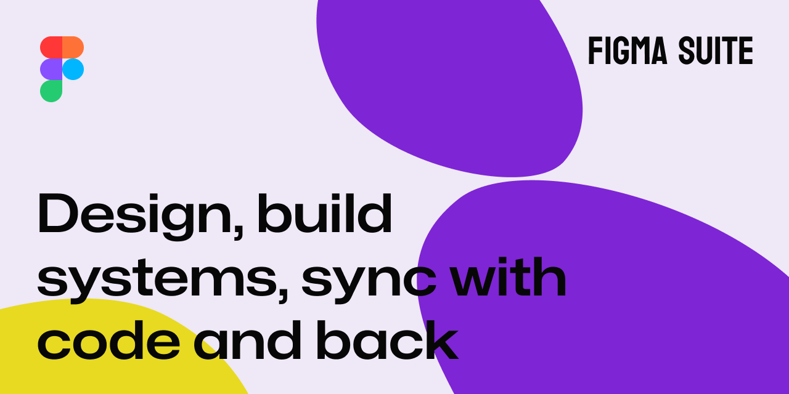

# figma-suite

A Claude Code skill set for Figma. Syncs design tokens, builds component libraries, designs screens, and audits for design system compliance — all through natural language.

Turns the official Figma MCP server into a full design workflow: proper auto-layout, variable bindings on every property, component composition via instances, text styles, native slots, and screenshot-validated output. No hardcoded values, no detached instances, no raw hex codes.

A bidirectional loop keeps code and Figma in sync — talk to the agent, edit tokens/components/designs on either side, and run `sync` to converge. The code↔Figma relationship lives in a Zod-validated `component-mappings/` directory (one `{id}.json` per component) with flexible property- and value-level mapping (so code `style` can map to Figma `Type`, and `"primary"` to `"Primary"`), and bridges to Figma Code Connect when available.

## Requirements

- [Claude Code](https://claude.com/claude-code) CLI
- [Figma MCP Server](https://developers.figma.com/docs/figma-mcp-server/remote-server-installation/) (official remote server at `https://mcp.figma.com/mcp`)
- Figma files with edit access

## Installation

### Via Claude Code CLI (recommended)

```bash
# 1. Add the marketplace
/plugin marketplace add robukh/figma-suite

# 2. Install the plugin
/plugin install figma-suite@figma-suite
```

### Via skills CLI

```bash
npx skills add robukh/figma-suite
```

Select **Claude Code** when prompted for the agent.

### Manual install

Clone or download this repo, then copy the skill folder.

Project-level:

```bash
cp -r skills/figma-suite/ .claude/skills/figma-suite/
```

Personal (all projects):

```bash
# macOS / Linux
cp -r skills/figma-suite/ ~/.claude/skills/figma-suite/

# Windows (PowerShell)
Copy-Item -Recurse skills/figma-suite/ "$env:USERPROFILE/.claude/skills/figma-suite/"
```

## Setup

1. Ensure the official Figma MCP server is connected
2. Run `/figma-suite` — it auto-runs setup on first use

Setup asks for your Figma file URLs, scans your libraries for variables and components, and generates project-specific design rules that guide all workflows.

During setup, you choose where to save the workspace:
- **Project-level** (default) — `.figma-suite/` in your project directory (shareable with teammates)
- **Global** — `<HOME>/.claude/figma-suite/{project-name}/` (personal, not committed)

- **With a codebase** — scans your project for tokens and components
- **Standalone** — paste Figma file URLs, no codebase needed
- **Multiple libraries** — supports multiple DS library files (e.g., icons + components)
- **Multiple design files** — supports multiple design files per project
- **Design rules** — auto-generates project-specific design rules from your library, fully editable

## Updating

```bash
# If installed via Claude Code CLI
/plugin update figma-suite

# If installed via skills CLI
npx skills update robukh/figma-suite
```

## Usage

```
/figma-suite                   # Auto-setup on first run, then show workflow menu
/figma-suite setup             # (Re)scan project, generate token/component mappings
/figma-suite sync              # Full bidirectional loop: tokens + components + mapping
/figma-suite sync --tokens     # Tokens only (classic token sync)
/figma-suite sync --components # Components + mapping only
/figma-suite sync --to-figma   # One-way push to Figma (composes with scope flags)
/figma-suite sync --to-code    # One-way pull to code (composes with scope flags)
/figma-suite build-library     # Generate Figma component library
/figma-suite design <desc>     # Design a screen in Figma
/figma-suite audit             # Audit Figma file for DS compliance
/figma-suite update-guide      # Sync design guidelines both ways
```

## What It Does

### Design Screens
Composes production-quality screens in Figma using your design system. Every element is a component instance with variables bound to every property — colors, spacing, radius, typography. Follows your project's design rules for layout, spacing hierarchy, and typography scale. Validates every section with screenshots.

### Build Component Libraries
Reads your components (from code or from Figma), extracts variants/states/props, and generates Figma component sets with auto-layout, variable bindings, native slots (instance swap for fixed swappable children), text properties, and boolean toggles. Builds in dependency order — primitives first, composites last. Every component is fully parameterized, zero raw values.

### Sync (bidirectional loop)
The cyclical sync across three lanes — **tokens**, **components**, and the **mapping** itself. Detects drift, shows a dry-run report, applies after approval, then re-reads and updates the `component-mappings/` files so the agent always holds an up-to-date code↔Figma picture. Token sync supports W3C Design Tokens, Style Dictionary, CSS Custom Properties, Tailwind, and JS theme objects. Component sync diffs live Figma properties/values against the mapping's flexible `propertyMap`. Optionally compiles eligible mappings into Figma Code Connect (`.figma.ts`) when on an Org/Enterprise plan — and works fully without it.

### Audit
Read-only inspection of any Figma screen for design system compliance. Checks token binding, component usage, layout quality, and variable health. Scores 0–100 with severity-ranked findings and actionable recommendations.

### Update Guidelines
Syncs design documentation between your project's design rules, codebase docs, and Figma annotations/documentation pages.

## Design Principles

The agent follows these rules in every workflow:

- **Zero raw values, bound by role** — every fill, stroke, radius, padding, gap, and font property is bound to a variable, choosing the semantically-correct token (not just a pixel match)
- **Component composition** — nested components are instances, never rebuilt from primitives
- **Text styles** — typography applied via Text Styles binding all 4 properties (family, size, weight, line-height)
- **Native slots** — content slots use native SLOT properties (INSTANCE_SWAP for fixed swappable children), not empty frames
- **No text glyphs as icons** — icons are real components, never typed characters (`✕`, `✓`, `→`)
- **Hug contents** — parent components adapt when children resize, hide, or swap
- **Screenshot + verification table** — every visual change is screenshotted, and component creation reports a rule→status→actual verification table, not just a picture
- **Ask when unsure** — the agent derives design decisions from your library; when ambiguous, it asks

The craft behind these rules — token-by-role choice, component anatomy, variant economics, composition, iconography, and a "what a senior rejects" quality bar — lives in [design-judgment.md](skills/figma-suite/reference/design-judgment.md).

## File Structure

```
.claude-plugin/
├── marketplace.json                       # Plugin marketplace definition
└── plugin.json                            # Plugin manifest
skills/figma-suite/                        # Skill
├── SKILL.md                               # Main orchestration + rules
├── workflows/
│   ├── setup.md                           # First-time project init
│   ├── sync.md                            # Bidirectional loop: tokens + components + mapping
│   ├── build-library.md                   # Component library generation
│   ├── design-screen.md                   # Screen design composition
│   ├── audit.md                           # Design system audit
│   └── update-guidelines.md               # Guideline sync
├── reference/                             # Universal rules (no project-specific data)
│   ├── design-judgment.md                 # Craft layer: token-by-role, anatomy, variant economics, composition, iconography, quality bar
│   ├── config-schema.md                   # Config structure, multi-file model, rules-file formats
│   ├── mapping-schema.md                  # component-mappings/{id}.json Zod schema + Code Connect bridge
│   ├── token-map.md                       # Token format → Figma variable mapping rules
│   ├── component-contracts.md             # Component → Figma translation rules
│   ├── plugin-api-patterns.md             # Figma Plugin API usage patterns + known constraints
│   ├── figma-file-structure.md            # File/page organization conventions
│   └── naming-conventions.md              # Naming presets for components, properties, tokens
└── schema/                                # Optional, on-demand mapping validator (zero-dep by default)
    ├── mapping.schema.json                # JSON Schema for component-mappings/{id}.json (editor autocomplete via $schema)
    ├── meta.schema.json                   # JSON Schema for component-mappings/_meta.json (version/timestamp)
    ├── validate.mjs                       # node validate.mjs <component-mappings-dir> — installs zod only if run
    └── package.json                       # Pins zod, scoped here so the skill root stays zero-dependency

Generated by /figma-suite setup — goes into <HOME>/.claude/figma-suite/{project-name}/:
├── config.json                            # Project config (libraries, design files, presets)
├── design-rules.md                        # Rules for designing in Figma (user-editable)
├── code-rules.md                          # Rules for writing code from Figma (user-editable)
├── token-map.generated.md                 # Your tokens → Figma variables
├── component-contracts.generated.md       # Your components → Figma component sets
└── component-mappings/                     # Code ↔ Figma mapping — one {id}.json per component (Zod-validated)
    ├── {id}.json                           # One standalone ComponentEntry, named by id slug
    └── _meta.json                          # Optional schema version + last-generation timestamp
```

## Security

This skill depends on the [official Figma MCP server](https://developers.figma.com/docs/figma-mcp-server/remote-server-installation/) (`https://mcp.figma.com/mcp`), a first-party remote endpoint operated by Figma, Inc. This is the **only** external runtime dependency.

**What happens at runtime:**

- The `mcp__figma__use_figma` tool sends Figma Plugin API code to Figma's MCP server, which executes it within the user's authenticated Figma session.
- All other `mcp__figma__*` tools make structured, read-only or declarative requests to the same server.

**Access controls:**

- Users must explicitly authenticate via OAuth before any operations work. No anonymous or implicit access is possible.
- Operations are scoped to Figma files the authenticated user has edit access to. The skill cannot access files beyond the user's existing permissions.
- OAuth tokens are managed by the MCP server and the user's Figma account — the skill never sees, stores, or transmits credentials.

**What this skill does NOT do:**

- Send data to any skill-author-controlled endpoint.
- Collect, store, or exfiltrate user data, tokens, or credentials.
- Communicate with any server other than the official Figma MCP endpoint.
- Require network access beyond `https://mcp.figma.com/mcp`.

**Reporting security issues:**

If you discover a security vulnerability in this skill, please open a private security advisory on this repository. For issues with the Figma MCP server itself, report to [Figma's security team](https://www.figma.com/security/).

## Contributing

Contributions are welcome! Feel free to open issues and pull requests.

## License

MPL-2.0 — see [LICENSE](LICENSE)
